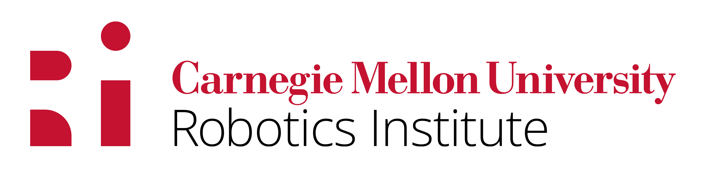

<p align="center">
<h2 align="center">NeLiS: Neural Light Simulator for 📷Camera-Light🔦 Calibration</h2>
<!-- <p align="center">
   <h4 align="center"><a href="https://www.linkedin.com/in/kaining/">Kaining Huang</a> | <a href="https://scholar.google.com/citations?user=n11gQKoAAAAJ&hl=en"><strong>Tianyi Zhang</strong></a></h4>
</p> -->
</p>
<br>

>“There are two ways of spreading light: to be the candle or the mirror that receives it.” ― Edith Wharton (1862-1937)
<p align="center">
       
    
  </a>
</p>

## Todos and Timelines
* [Arxiv](https://arxiv.org/abs/2403.10814) release: March 20, 2024 (Done)
* DarkGS code (sister repo): [DarkGS](https://github.com/tyz1030/darkgs) DarkGS relighting preview :point_down: (Novel view rendering sequence)
<p align="center">
  <a href="">
    
  </a>
</p>


## Dependencies
```
pip install git+https://github.com/princeton-vl/lietorch.git PySide6
```

## Quick Start
1. Clone the repo:
```
https://github.com/tyz1030/neuralight.git
```
2. Run gui.py:
```
python3 gui.py
```
&emsp; Our toy dataset will be automatically loaded.\
&emsp; 3. Load our toy data checkpoint by simply click "LOAD" button on the gui.\
&emsp; 4. Check the (checkbox next to the) parameters you want to optimize and uncheck those to be freezed.\
&emsp; 5. Click "START" to start finetuning the model.\
&emsp; 6. Click "SAVE" to save your finetuned model.\
&emsp; 7. For more instructions see the following illustration:
<p align="center">
  <a href="">
    
  </a>
</p>

## Make Your Own Calibration Target
An example calibration target can be downloaded [here](NeLiS_target_example.pdf) but feel free to generate your own target. We use [moms-apriltag](https://pypi.org/project/moms-apriltag/).

## Citation
[Arxiv](https://arxiv.org/abs/2403.10814)
```
@misc{zhang2024darkgs,
      title={DarkGS: Learning Neural Illumination and 3D Gaussians Relighting for Robotic Exploration in the Dark}, 
      author={Tianyi Zhang and Kaining Huang and Weiming Zhi and Matthew Johnson-Roberson},
      year={2024},
      eprint={2403.10814},
      archivePrefix={arXiv},
      primaryClass={cs.CV}
}
```

## Acknowledgement
* This work is supported by NOAA.
* Copyright 2024 Kaining Huang and Tianyi Zhang, Carnegie Mellon University. All rights reserved.
